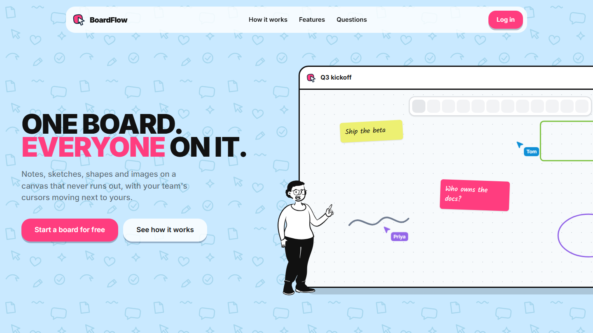
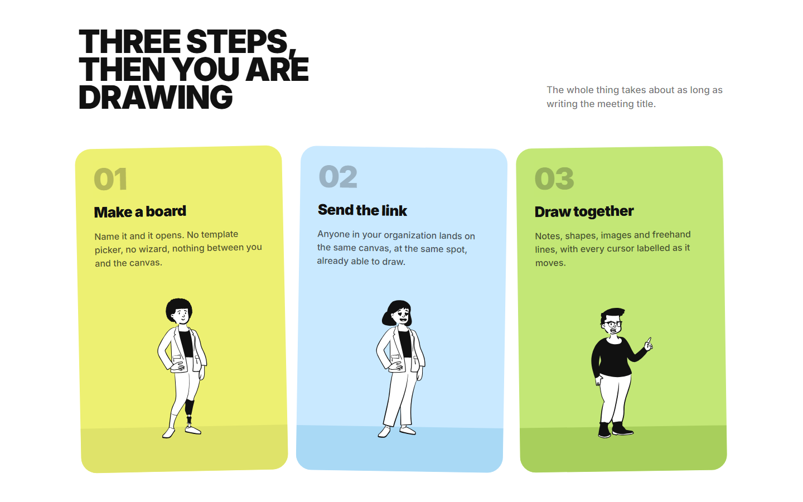
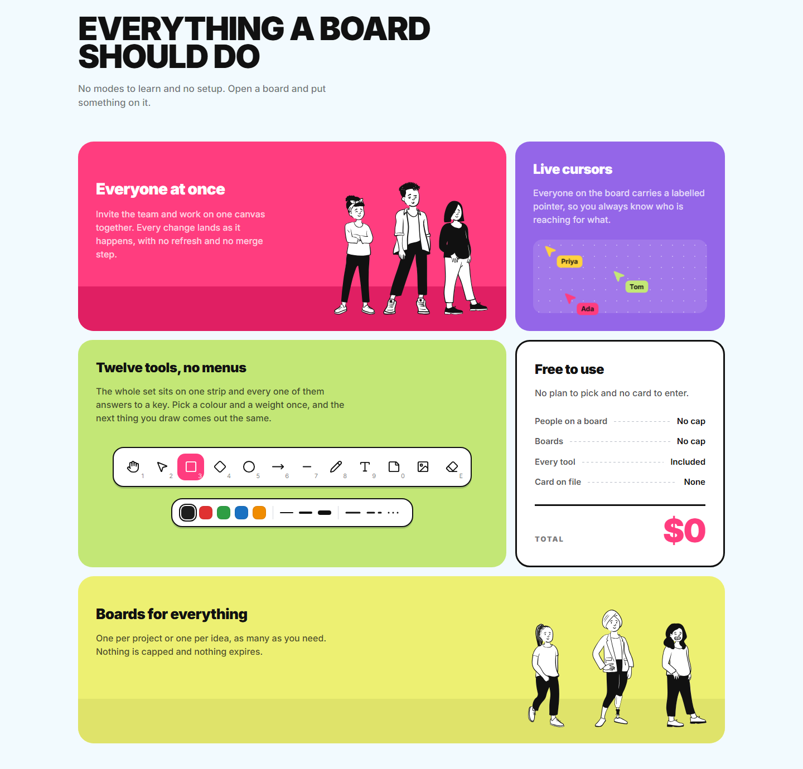

<div align="center">


# BoardFlow

**One board. Everyone on it.**

A collaborative whiteboard your whole team draws on at once: shapes, arrows,
sticky notes, freehand ink and text on an infinite canvas, with everyone's
cursor moving next to yours.

[**Try it live →**](https://board-flow.vercel.app)

<br />



</div>

<br />

## Screenshots

<table>
  <tr>
    <td width="50%"></td>
    <td width="50%"></td>
  </tr>
</table>

## What you get

- **Twelve tools, one key each.** Hand, select, rectangle, diamond, ellipse,
  arrow, line, draw, text, sticky note, image and eraser. Every shape has its
  own stroke, fill, weight, dash, corners and opacity.
- **Live together.** Labelled cursors, and shapes appear on everyone's screen
  while you drag them out. Undo is per person, so yours never touches theirs.
- **Organizations.** Boards belong to a team, not a person. Invite by email and
  manage members, roles and boards in one place.
- **Sign in your way.** Password, Google, GitHub or a magic link.

## Built with

Next.js 16 · React 19 · TypeScript · Convex · Convex Auth · Liveblocks ·
Tailwind CSS 4 · shadcn/ui · Vitest

## Run it locally

You need Node 22+, Yarn, and free accounts on [Convex](https://convex.dev) and
[Liveblocks](https://liveblocks.io).

```bash
git clone https://github.com/Biplo12/BoardFlow.git
cd BoardFlow
yarn install
cp .env.example .env.local
```

Create the backend and leave it running, it pushes `convex/` as you save:

```bash
npx convex dev
```

In a second terminal, set up authentication. When it asks for the site URL,
give the address you will open, with the port (`http://localhost:3000`):

```bash
npx @convex-dev/auth
```

Put your Liveblocks secret key in `.env.local`, then start the app:

```
LIVEBLOCKS_SECRET_KEY=sk_dev_...
```

```bash
yarn dev
```

Open [localhost:3000](http://localhost:3000), create an account, make an
organization and open a board.

<details>
<summary>Google sign-in</summary>

```bash
npx convex env set AUTH_GOOGLE_ID <client id>
npx convex env set AUTH_GOOGLE_SECRET <client secret>
```

Add this to the authorised redirect URIs of your Google OAuth client:

```
https://<your-deployment>.convex.site/api/auth/callback/google
```

It is `.convex.site`, not `.convex.cloud`. Google can take a few hours to
honour a new URI, so an early `redirect_uri_mismatch` usually means "not yet".

</details>

<details>
<summary>Scripts</summary>

| | |
| --- | --- |
| `yarn dev` | development server |
| `yarn build` / `yarn start` | production build and server |
| `yarn lint` / `yarn typecheck` | eslint and `tsc --noEmit` |
| `yarn test` / `yarn test:watch` | vitest |
| `node scripts/seed-board.mjs <boardId> --replace` | fill a board with an example diagram |

CI runs lint, typecheck, test and build on every push and pull request.

</details>

<details>
<summary>Deploying</summary>

The frontend runs on Vercel, the backend on Convex. Set the Vercel build
command to:

```
npx convex deploy --cmd 'next build'
```

and add `CONVEX_DEPLOY_KEY`, `NEXT_PUBLIC_CONVEX_URL` and
`LIVEBLOCKS_SECRET_KEY` to the Vercel project. The Convex production
deployment needs its own `SITE_URL`, `JWT_PRIVATE_KEY`, `JWKS` and Google
credentials.

</details>

## Contributing

See [CONTRIBUTING.md](CONTRIBUTING.md) for the workflow and
[CLAUDE.md](CLAUDE.md) for the conventions the code follows. Security reports
go through [SECURITY.md](SECURITY.md).

## Licence

[MIT](LICENSE)
